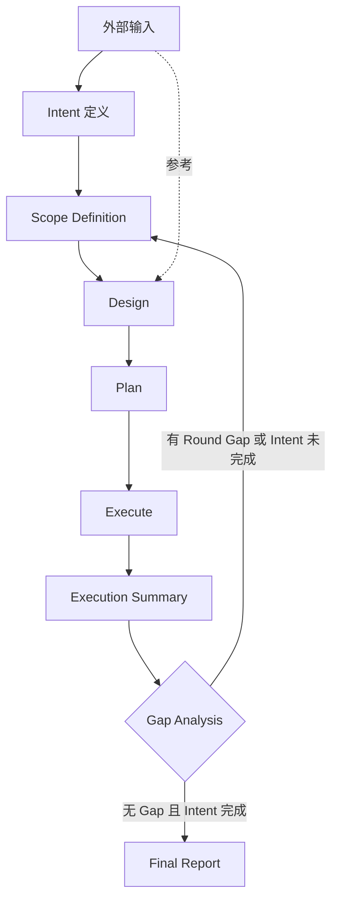
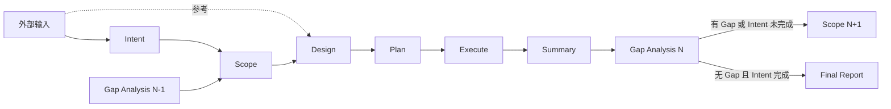

# GDIM — Gap-Driven Iteration Model

> **版本**：1.5 | **状态**：可执行规范

GDIM 是偏差驱动的 AI 编程工作流规范，确保设计、计划、实现的可追溯性。

---

## 1. 模型定位

### 1.1 职责划分

| 角色 | 职责 |
|------|------|
| **人类** | 提供外部输入、定义 Intent、审核 Scope、识别 Gap、裁决取舍 |
| **AI** | 生成设计/计划、执行实现、辅助 Gap 分析、提出建议 |
| **GDIM** | 强制闭环、确保可追溯性、防止 Scope 漂移 |

### 1.2 适用场景

| 任务类型 | 典型外部输入 | 适用度 |
|---------|-------------|:------:|
| 新功能开发 | 需求文档、设计文档 | ✓✓✓ |
| Bug 修复 | Bug 分析报告、复现步骤 | ✓✓ |
| 代码重构 | 重构规范、技术债清单 | ✓✓✓ |
| 性能优化 | 性能分析报告、基准数据 | ✓✓ |
| 技术迁移 | 迁移方案、兼容性要求 | ✓✓✓ |

**不适用**：探索性原型、一次性脚本、紧急热修复

---

## 2. 核心规则

| 规则 | 说明 |
|------|------|
| **Gap 定义** | 期望状态与实际状态之间具有工程意义的结构性偏差 |
| **迭代驱动** | 进入下一轮需要：有未关闭 Gap **或** Intent 未完全覆盖 |
| **Scope 来源** | R1: Intent only; R2+: Intent + Gap |
| **内容合法性** | 所有内容必须可追溯到 Intent 或 Gap |

---

## 3. 工作流



**说明**：
- 外部输入 → Intent：人类从外部文档中提取合适规模的任务
- 外部输入 → Design：设计阶段可引用外部文档作为参考
- Gap Analysis 包含两个层次的判断（见第 4 节）

---

## 4. Gap Analysis 双层结构

Gap Analysis 包含两个层次的分析：

| 层次 | 对照对象 | 目的 |
|------|---------|------|
| **Round Gap** | 本轮 Scope/Design vs 执行结果 | 识别本轮的具体偏差 |
| **Intent Coverage** | Intent vs 累计完成状态 | 判断是否需要下一轮 |

**退出条件**：
- 本轮无 High Severity Gap **且** Intent 已完全覆盖 → Final Report
- 否则 → 进入下一轮

---

## 5. Gap 分类

| Code | Category | 描述 |
|------|----------|------|
| G1 | Requirement | 需求/目标/业务语义理解偏差 |
| G2 | Design | 架构/设计层面遗漏或错误 |
| G3 | Plan | 计划不可执行或步骤错误 |
| G4 | Implementation | 实现与设计不一致 |
| G5 | Quality | 性能/安全/可维护性问题 |
| G6 | Constraint | 未满足约束条件 |

---

## 6. 文件规范

### 6.1 目录结构

```
.ai-workflows/YYYYMMDD-task-slug/
├── 00-intent.md                    # 设计目标（全局）
├── 00-intent.changelog.md          # Intent 变更日志
├── 00-scope-definition.roundN.md   # 范围定义
├── 01-design.roundN.md             # 设计
├── 02-plan.roundN.md               # 计划
├── 03-gap-analysis.roundN.md       # 偏差分析
├── 04-execution-log.roundN.md      # 执行日志（可选）
├── 05-execution-summary.roundN.md  # 执行摘要
└── 99-final-report.md              # 终局报告
```

外部输入文件（需求文档、设计文档等）直接引用其原始路径，无需复制。

### 6.2 文件职责

| 文件 | 职责 | 必需 |
|------|------|:----:|
| `00-intent.md` | 从外部输入提取的设计目标与成功标准 | ✓ |
| `00-scope-definition.roundN.md` | 本轮范围（In/Out of Scope） | ✓ |
| `01-design.roundN.md` | 系统/模块设计 | ✓ |
| `02-plan.roundN.md` | 可执行计划 | ✓ |
| `03-gap-analysis.roundN.md` | 偏差识别与关闭策略 | ✓ |
| `05-execution-summary.roundN.md` | 执行结果总结 | ✓ |

---

## 7. 模板

### 7.1 Intent (`00-intent.md`)

```markdown
# Intent & Baseline

## External References
- 需求文档: docs/requirements.md
- 设计文档: docs/design-spec.md
（无外部输入时可省略此节）

## 1. Design Goal
<从外部输入提取的目标描述>

## 2. Non-Goals
- <不解决的内容>

## 3. Success Criteria
- [ ] <条件>

## 4. Hard Constraints
- 技术栈：
- 性能/安全：

## 5. Assumptions
- <假设>
```

### 7.2 Scope Definition

**Round 1：**
```markdown
# Scope Definition — Round 1

## Scope Basis
- Intent: 00-intent.md

## In Scope
- <本轮实现的 Intent 子集>

## Out of Scope
- <本轮排除的内容>
```

**Round 2+：**
```markdown
# Scope Definition — Round N

## Scope Basis
- Intent: 00-intent.md
- Gap Source: 03-gap-analysis.roundN-1.md
- Gaps to Close: GAP-01, GAP-02

## In Scope
- <未完成 Intent + 待关闭 Gap>

## Out of Scope
- <本轮排除的内容>
```

### 7.3 Design 头部声明

```yaml
---
round: N
driven_by: Intent | [GAP-01, GAP-02]
scope: 00-scope-definition.roundN.md
external_refs:                        # 可选：引用外部文档
  - docs/design-spec.md#section-3
  - docs/api-contract.md
---
```

### 7.4 Gap Analysis

```markdown
# Gap Analysis — Round N

## 1. Round Gap（本轮偏差）

对照：本轮 Scope/Design vs 执行结果

### GAP-01: <标题>
| 字段 | 内容 |
|------|------|
| Category | G2 |
| Expected | ... |
| Actual | ... |
| Severity | High/Medium/Low |

## 2. Intent Coverage（Intent 覆盖度）

| Intent 条目 | 状态 | 完成 Round |
|------------|------|-----------|
| Design Goal 1 | ✓ 完成 | R1 |
| Design Goal 2 | ◐ 部分完成 | R1-R2 |
| Design Goal 3 | ○ 未开始 | — |
| Success Criteria 1 | ✓ 完成 | R2 |

**覆盖度**：60% (3/5)

## 3. Closure Strategy

| Gap ID | Strategy | Target Round |
|--------|----------|--------------|
| GAP-01 | ... | N+1 |

## 4. Exit Decision

- [ ] 本轮无 High Severity Gap
- [ ] Intent 已完全覆盖

**结论**：进入 Round N+1 / 输出 Final Report
```

### 7.5 Final Report

```markdown
# Final Report

## Gap Summary
| Gap ID | Category | Introduced | Resolved | Status |
|--------|----------|------------|----------|--------|
| GAP-01 | G2 | R1 | R2 | Closed |

## 终止说明
- <完成状态说明>
```

---

## 8. 外部输入类型

| 任务类型 | 典型外部输入 | Intent 提取要点 |
|---------|-------------|----------------|
| 新功能 | 需求文档、PRD、设计稿 | 功能边界、验收标准 |
| Bug 修复 | Bug 报告、复现步骤、日志 | 预期行为、修复范围 |
| 重构 | 重构规范、代码分析报告 | 重构目标、不变式约束 |
| 性能优化 | 性能报告、基准数据 | 优化目标、性能指标 |
| 迁移 | 迁移方案、兼容性矩阵 | 迁移范围、兼容性要求 |

**原则**：Intent 是外部输入的**精炼子集**，而非全量复制。

---

## 9. Round 规模

| Round | 目标 | 规模限制 |
|-------|------|---------|
| R0 | 稳定 Intent | 仅 `00-intent.md` |
| R1 | 最小切口 | In Scope ≤3, 模块 =1 |
| R2+ | 关闭 Gap | 新增 Scope 1-2 项 |
| Rn | 收敛 | 仅 Quality/Constraint Gap |

**原则**：R1 未产生 Gap 视为设计超量。

---

## 10. 违规判定

| 类型 | 违规情况 |
|------|---------|
| Scope 违规 | 引入 Intent/Gap 之外的内容 |
| 设计违规 | 内容无法映射到 Scope 或 Gap |
| 禁止行为 | 预留设计、占位结构、推测性设计 |

**原则**：不确定时必须向用户提问。

---

## 11. 快速参考



| 约束 | R1 | R2+ |
|------|----|----|
| Scope 来源 | Intent | Intent + Gap |
| 设计驱动 | Intent | Gap |
| 外部引用 | 可选 | 可选 |
| 进入下轮条件 | — | 有 Gap 或 Intent 未完成 |
